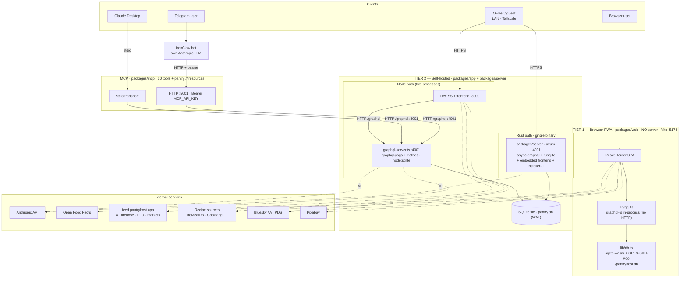
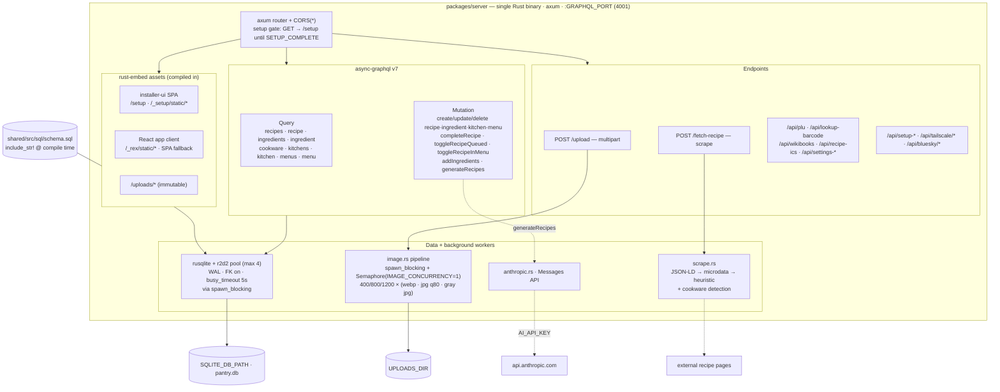
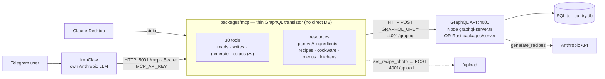
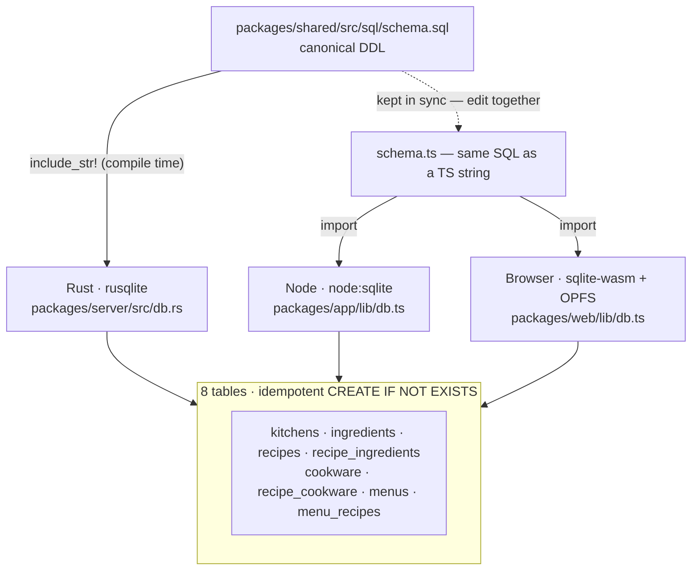

# Pantry Host — Architecture

A privacy-first kitchen companion that ships **three ways from one codebase**: a
browser-native PWA, a self-hosted server, and a static marketing page. All data stays
on the user's hardware. This document draws how the pieces fit — with emphasis on the
**Rust backend**, the **Tier 1 vs Tier 2** split, and the **MCP** integrations.

> Diagrams are [Mermaid](https://mermaid.js.org/) and render natively on GitHub. If
> you're reading this in an editor without a Mermaid preview, paste a block into
> [mermaid.live](https://mermaid.live).

## Where each package lives

| Package | Role | Stack | Default port |
|---|---|---|---|
| `packages/web` | **Tier 1** — browser PWA, no server | Vite · React Router · `@sqlite.org/sqlite-wasm` + OPFS · `graphql-js` | `5174` (dev) |
| `packages/app` | **Tier 2** — self-hosted frontend + Node GraphQL | Rex SSR · graphql-yoga + Pothos · `node:sqlite` | `3000` (Rex) / `4001` (GraphQL) |
| `packages/server` | **Tier 2** — Rust GraphQL backend (drop-in, IoT) | axum · async-graphql · rusqlite + r2d2 | `4001` |
| `packages/installer-ui` | First-boot setup wizard, embedded in the Rust binary | Vite · React | `5176` (dev) |
| `packages/mcp` | MCP server — exposes the GraphQL API as AI tools | `@modelcontextprotocol/sdk` · zod | `5001` (HTTP mode) |
| `packages/shared` | Shared types, adapters, components, **canonical SQL schema** | TypeScript | — |
| `packages/feed` | AT Protocol firehose indexer | Node · better-sqlite3 (Fly.io) | `feed.pantryhost.app` |
| `packages/marketing` | Static landing page | Vite (Cloudflare Pages) | `5173` (dev) |

### Ports & key env vars

| Port | Service |
|---|---|
| `3000` | Rex SSR frontend (Node Tier-2 path) |
| `4001` | GraphQL API — **either** `graphql-server.ts` (Node) **or** `packages/server` (Rust) |
| `5001` | MCP HTTP transport (`--http`) |
| `5174` | Browser PWA dev server |

`SQLITE_DB_PATH` (default `./pantry.db`), `GRAPHQL_PORT` (4001), `AI_API_KEY`
(Anthropic, enables `generateRecipes`), `GRAPHQL_URL` (MCP → GraphQL),
`MCP_PORT`/`MCP_API_KEY` (MCP HTTP), `UPLOADS_DIR`, `IMAGE_CONCURRENCY`,
`ENABLE_IMAGE_PROCESSING`, `PUBLIC_API_ORIGIN` (app's browser → API origin).

---

## 1. System overview

The defining **Tier 1 vs Tier 2** distinction is *where GraphQL executes*. Tier 1 runs
the **same GraphQL schema in-browser** (via `graphql-js`) against SQLite-WASM/OPFS — no
network, no server, no AI. Tier 2 runs GraphQL as an **HTTP service on `:4001`** that
the Rex SSR app and the MCP server POST to; its backend is **either** the Node
`graphql-server.ts` **or** the Rust `packages/server` (a drop-in replacement). Both
tiers reuse the same resolver surface and the same DDL.

---

## 2. The Rust layer (`packages/server`)

The Rust backend is **all-in-one**: a single axum binary on one port (`:4001`) serves
GraphQL, the upload/scrape endpoints, the first-boot **installer-ui** wizard, the
**embedded React app**, and `/uploads`. (Compare the Node path, which splits Rex on
`:3000` from GraphQL on `:4001` into two processes.) It's built for Pi-3-class hardware:
`opt-level=z`, fat LTO, `panic=abort`, `strip` for a small stripped binary; an r2d2
pool capped at 4 connections; and an image `Semaphore` defaulting to 1 to bound RAM. DB
calls run on `spawn_blocking`. The schema DDL is baked in at compile time via
`include_str!`.

**Notable details**

- **Setup gate:** `GET`/`HEAD` to non-installer paths redirect to `/setup` until
  `SETUP_COMPLETE`; `/api/*`, `/graphql`, and write methods always pass through.
- **Image pipeline:** each upload fans out to 3 widths × {WebP, JPEG q80, grayscale JPEG
  q80} at 16:9, GIFs preserved, serialized by a tokio `Semaphore`; a friendly
  `{slug}.jpg` copy is made for ICS calendar exports.
- **Scraping:** `/fetch-recipe` tries JSON-LD → schema.org microdata → heuristic HTML,
  then substring-matches the cookware table.
- **`generateRecipes`:** snapshots the ingredients + cookware tables, prompts the
  Anthropic Messages API (requires `AI_API_KEY`), and inserts results with
  `source = "ai-generated"`.

---

## 3. MCP integration(s)

The MCP server is a **stateless translation layer** — it never touches SQLite, it only
POSTs GraphQL to `:4001` (`GRAPHQL_URL`). One entrypoint (`src/index.ts`) offers two
transports: **stdio** for Claude Desktop, and **HTTP `:5001`** (with an optional
`MCP_API_KEY` bearer) for networked clients. The notable HTTP consumer is **IronClaw**,
a Telegram bot running on the Mini with its *own* Anthropic LLM:
`Telegram → IronClaw → MCP :5001 → GraphQL :4001 → SQLite`. The only non-GraphQL
endpoint MCP touches is `/upload` (used by `set_recipe_photo`).

Because MCP targets the GraphQL contract (not the database), it works identically
against the Node or the Rust backend, and requires the GraphQL server to be running on
`:4001`.

---

## 4. Shared schema — single source of truth

One DDL, three runtimes. `packages/shared/src/sql/schema.sql` is the canonical file;
`schema.ts` mirrors it as a TypeScript string for the JS/TS consumers. The two files sit
side-by-side and **must be edited together** (see the schema-sync gotcha and
`runMigrations()` note in CLAUDE.md). The DDL is idempotent (`CREATE TABLE IF NOT
EXISTS …`) and applied on first connection by each runtime.

**Conventions:** IDs are TEXT UUIDs; timestamps are ISO-8601 TEXT; tag/alias/photo
arrays and `product_meta` are JSON in TEXT columns; booleans are INTEGER 0/1; decimals
are REAL.

---

## See also

- `CLAUDE.md` — per-package detail, conventions, and gotchas.
- `packages/server/README.md` — Rust backend scope and build.
- `packages/mcp` — the 30 MCP tools and `pantry://` resources.
